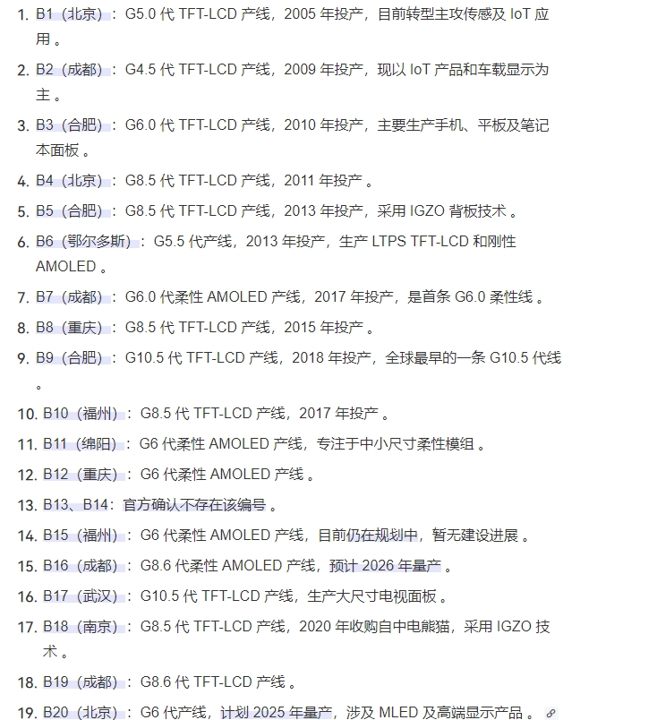

<h1 align="center">OSPTEK 1.47″ TFT 172×320 (ST7789 · I80)</h1>

<b>TFT module · I80 (8-bit 8080) · ST7789 · multi-version index</b>

English | <a href="./README.md">简体中文</a>

  
  
  
  

## Contents

- [About](#about)
- [ST7789 family variant notes](#st7789-family-variant-notes)
- [Versions](#versions)
- [YDP147HT001-V3](#ydp147ht001-v3)
- [Buy](#buy)
- [Support](#support)

---

## About

This repository covers the **1.47″ 172×320 TFT (I80 · ST7789)** display module family. Silicon may be ST7789 / ST7789V3 (also called ST7789P3); the public family name remains **ST7789**.

The **root README is the navigation page**. Use the table below for a quick scan; open **Full docs** to enter that **part-number folder** under `versions/` (product page, datasheets, and examples live there).

Spec ID (repository name): `1.47-tft-172x320-i80-st7789`

---

## ST7789 family variant notes

- Comparison: [`docs/ST7789-variants-comparison.jpg`](./docs/ST7789-variants-comparison.jpg)
- Companion notes: [`docs/ST7789-variants-notes.jpg`](./docs/ST7789-variants-notes.jpg)

---

## Versions

| Version | Promo | Summary | Full docs |
| ------- | ----- | ------- | --------- |
| YDP147HT001-V3 |  | [Summary](#ydp147ht001-v3) | [Full docs](./versions/YDP147HT001-V3/) |

---

## YDP147HT001-V3

**Notes:** Capacitive touch (CST816D); 8-bit 8080 MCU (I80); silicon is ST7789V3 (also ST7789P3); repo label stays ST7789.

Full product page, datasheets, and examples: [versions/YDP147HT001-V3/](./versions/YDP147HT001-V3/)

---

## Buy

  
  &nbsp;&nbsp;
  

**Overseas (AliExpress)**

- Store: [OSPTEK Official Store](https://www.aliexpress.com/store/1105701619)

**China (Taobao)**

- Store: [鱼鹰光电工厂店](https://shop110742373.taobao.com/)

---

## Support

- Technical support / product inquiry: <luyu@osptek.com>
- QQ group (China): **985881096**
- Website: <https://osptek.com/>
- Feel free to open an Issue in this repository if you have any questions

---

© 2026 OSPTEK · Materials in this repository are licensed under CC BY 4.0

