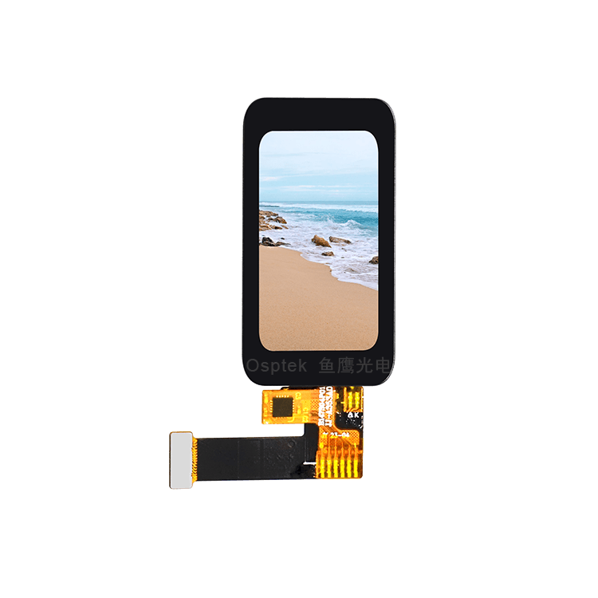

<p align="left"></p>

<h1 align="center">OSPTEK 1.47″ TFT 172×320（ST7789 · I80）</h1>

<p align="center"><b>触摸 TFT 模组 · I80（8-bit 8080）· ST7789</b></p>

<p align="center"><a href="./README_EN.md">English</a> | 简体中文 · <a href="../../README.md">规格族索引</a></p>

<p align="center">
  
  
  
  
</p>

<p align="center"></p>

## 目录

- [产品简介](#产品简介)
- [规格参数](#规格参数)
- [仓库结构](#仓库结构)
- [相关资料](#相关资料)
- [购买链接](#购买链接)
- [技术支持](#技术支持)

---

## 产品简介

OSPTEK **1.47 寸 172×320 TFT** 是一款 **I80（8-bit 8080 MCU）** 并口彩色显示模组，显示驱动为 **ST7789** 系列，触摸驱动为 **CST816D**。适合小型 HMI、手持终端与物联网人机界面等场景。

规格标识（仓库名）：`1.47-tft-172x320-i80-st7789`

当前模组版本：**YDP147HT001-V3**。电气与外形细节以 [`docs/YDP147HT001-V3.pdf`](./docs/YDP147HT001-V3.pdf) 为准。

> **驱动硅片：** 本料号实际为 **ST7789V3**（后续亦称 **ST7789P3**）。仓库名与对外通称仍用 **ST7789**；手册与初始化参数见下方资料。

## 规格参数

| 项目 | 规格 |
| ---- | ---- |
| 尺寸 | 1.47 英寸 |
| 类型 | TFT（Normally black） |
| 分辨率 | 172×320 |
| 接口 | I80（8-bit 8080 MCU） |
| 驱动 IC | ST7789（硅片 ST7789V3 / ST7789P3） |
| 触摸驱动 | CST816D |

> 完整外形尺寸、FPC 定义、供电与时序以产品规格书 / 驱动手册为准。

## 仓库结构

```text
1.47-tft-172x320-i80-st7789/           # 仓库根（导航见 ../../README.md）
└── versions/
    └── YDP147HT001-V3/                # 本料号完整资料
        ├── README.md
        ├── README_EN.md
        ├── images/
        └── docs/
```

## 相关资料

### 本产品资料

| 资料 | 链接 |
| ---- | ---- |
| 产品规格书（YDP147HT001-V3） | [`docs/YDP147HT001-V3.pdf`](./docs/YDP147HT001-V3.pdf) |
| 驱动 IC 数据手册（ST7789V3，亦称 ST7789P3） | [`docs/ST_7789_V3_SPEC_Preliminary_V0_0_200102_8f4b7f4d5d.pdf`](./docs/ST_7789_V3_SPEC_Preliminary_V0_0_200102_8f4b7f4d5d.pdf) |
| ST7789 系列版本对照（V2 / P3 / W3 等） | [`docs/ST7789-variants-comparison.jpg`](./docs/ST7789-variants-comparison.jpg) |
| ST7789 系列版本说明（配套） | [`docs/ST7789-variants-notes.jpg`](./docs/ST7789-variants-notes.jpg) |
| 触摸 IC 数据手册（CST816D） | [`docs/CST_816_D_V1_0_2_1b06dfb078.pdf`](./docs/CST_816_D_V1_0_2_1b06dfb078.pdf) |
| 初始化参数（INI） | [`docs/ST7789V3A-1.47IPS-2.2gamma-20210818.INI`](./docs/ST7789V3A-1.47IPS-2.2gamma-20210818.INI) |

## 购买链接

<p align="center">
  <a href="https://shop110742373.taobao.com/"></a>
  &nbsp;&nbsp;
  <a href="https://www.aliexpress.com/store/1105701619"></a>
</p>

**国内（淘宝）**

- 店铺：[鱼鹰光电工厂店](https://shop110742373.taobao.com/)

**海外（AliExpress）**

- 店铺：[OSPTEK Official Store](https://www.aliexpress.com/store/1105701619)

## 技术支持

- 技术支持 / 产品咨询：<luyu@osptek.com>
- QQ 技术交流群：**985881096**
- 公司官网：<https://osptek.com/>
- 有任何问题，都可以在本仓库 Issues 中提问

---

<p align="center"><sub>© 2026 OSPTEK 鱼鹰光电 · 本仓库资料采用 CC BY 4.0 许可</sub></p>
